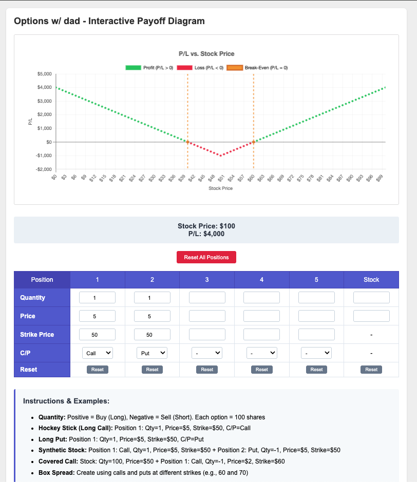

# Options Lego Visualizer

An interactive options payoff visualization tool that demonstrates how options work like Legos - you can combine them to create any payoff structure. This tool is a companion to the excellent video by Chris Schindler on Excess Returns.

## 📺 Video Tutorial

**Watch the video that inspired this tool:**
[The Hidden Logic of Options | Put-Call Parity Explained with Legos](https://www.youtube.com/watch?v=vYPulKD58fA)

In this video, Chris Schindler brilliantly explains:
- How options are like Legos that can be combined
- Put-Call Parity and synthetic positions
- Why a covered call is just a short put in disguise
- How to create any payoff structure using options

## 🎯 Purpose

This tool was created to help visualize the concepts taught in the video. Use it to:
- See real-time P/L diagrams as you build positions
- Understand how calls and puts combine to create synthetic positions
- Visualize break-even points automatically
- Experiment with complex strategies like box spreads

## 🚀 Features

- **Visual P/L Diagrams**: Color-coded dots show profit (green), loss (red), and break-even (amber)
- **Automatic Break-Even Detection**: Identifies and highlights where P/L = 0
- **Multiple Positions**: Combine up to 5 option positions plus stock
- **Synthetic Position Examples**: Try the examples from the video
- **Dynamic Scaling**: Y-axis automatically adjusts to your position size
- **Reset Functionality**: Individual and master reset buttons

## 📸 Screenshots

### Long Call Strategy

### Synthetic Stock Position

### Covered Call Strategy

## 💡 Quick Examples from the Video

### 1. Hockey Stick (Long Call)
- Position 1: Qty=1, Price=$5, Strike=$50, C/P=Call

### 2. Synthetic Stock
- Position 1: Call, Qty=1, Price=$5, Strike=$50
- Position 2: Put, Qty=-1, Price=$5, Strike=$50

### 3. Covered Call = Short Put
- Stock: Qty=100, Price=$50
- Position 1: Call, Qty=-1, Price=$2, Strike=$60

## 🛠️ Usage

1. Open `options-payoff.html` in your web browser
2. Enter positions in the table:
   - **Quantity**: Positive = Buy (Long), Negative = Sell (Short)
   - **Price**: Premium for options, purchase price for stock
   - **Strike**: Strike price for options
   - **C/P**: Select Call or Put
3. Watch the P/L diagram update in real-time
4. Hover over the chart to see exact P/L at any stock price

## 📚 Educational Value

This tool helps you understand:
- **Put-Call Parity**: See how C - P = S - K
- **Synthetic Positions**: Visualize how combinations create equivalents
- **Risk/Reward**: Instantly see max profit, max loss, and break-evens
- **Strategy Building**: Experiment with spreads, straddles, and more

## 🤝 Contributing

Feel free to submit issues, fork the repo, and create pull requests. Some ideas for enhancements:
- Add more pre-built strategy templates
- Include Greeks visualization
- Add time decay animation
- Export/share position configurations

## 📄 License

This project is licensed under the MIT License - see the [LICENSE](LICENSE) file for details.

## 🙏 Acknowledgments

- **Chris Schindler** ([@chrisschindler](https://twitter.com/chrisschindler)) for the excellent educational content
- **Excess Returns** podcast for making complex topics accessible
- The "Options with Dad" spreadsheet that inspired the interface

## 🔗 Links

- [Video: Put-Call Parity Explained with Legos](https://www.youtube.com/watch?v=vYPulKD58fA)
- [Moontower Newsletter](https://moontower.substack.com/)
- [Excess Returns Podcast](https://www.excessreturnspodcast.com/)

---

*"Options are Legos. You can build any payoff you want!"* - Chris Schindler